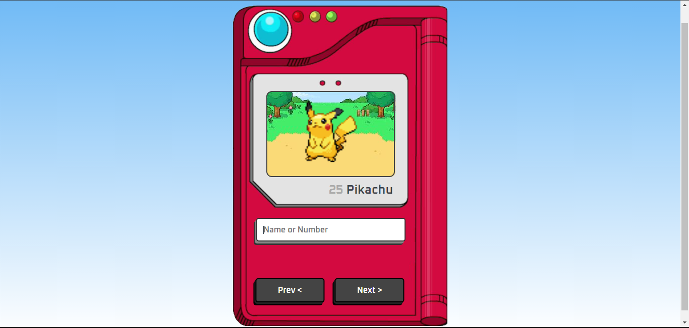

<h1 align="center"> Pokédex </h1>

Pokédex do anime Pokemon feita para estudos, através do canal no yotube <a href="https://www.youtube.com/@ManualdoDev">Manual do Dev</a>

  <a href="#-tecnologias">Tecnologias</a>&nbsp;&nbsp;&nbsp;|&nbsp;&nbsp;&nbsp;
  <a href="#-projeto">Projeto</a>&nbsp;&nbsp;&nbsp;|&nbsp;&nbsp;&nbsp;
  <a href="#memo-licença">Licença</a>

  

 

  

## 🚀 Tecnologias

Esse projeto foi desenvolvido com as seguintes tecnologias:

- HTML e CSS
- JavaScript
- [PokéAPI](https://pokeapi.co/)
- Git e Github

## 💻 Projeto

Esse projeto de pokédex foi realizado com o intuito de praticar JavaScript e Consumir uma API. Você pode pesquisar qualquer pokemon da primeira geração pelo nome ou numéro(id) do pokemon.

## :memo: Licença

Esse projeto está sob a licença MIT.